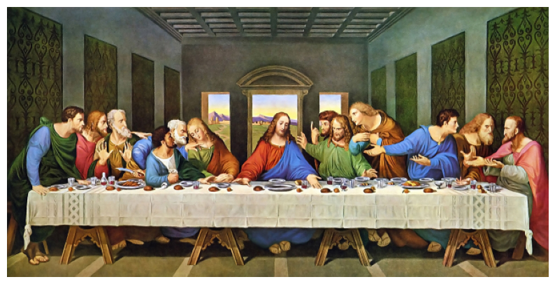
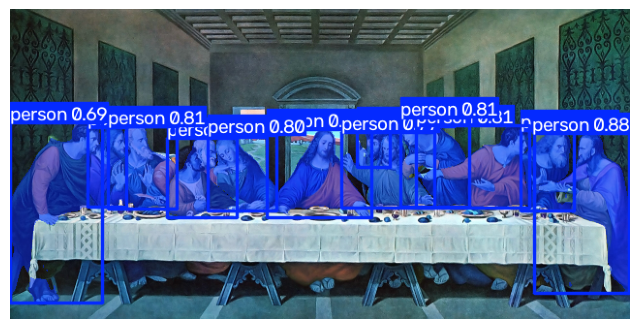
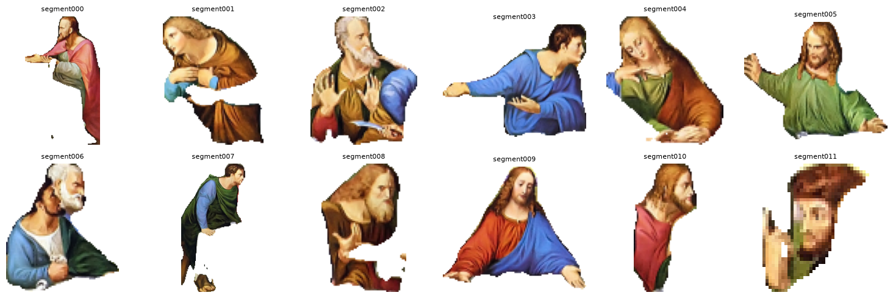
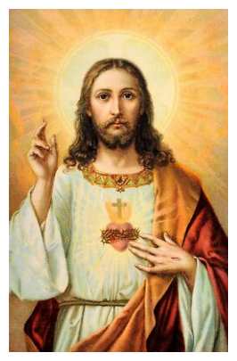
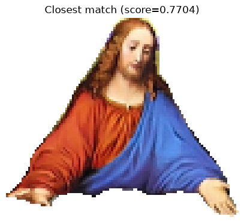

# Segment Search

Visual search over the subjects *within* the records of RKD Images.
Instead of matching whole images, figures are detected, extracted, and embedded individually.
Allows the search for cross-artwork motifs, where several pieces of art share similar subjects and components.

`segment_demonstration.ipynb` walks through the full pipeline end to end on a single image.
The production scripts (`index_segments.py`, `query_collection.py`, `app.py`) implement the same pipeline at a larger scale.

## Pipeline

### 1. Load and preprocess an image

An artwork is loaded and downscaled for detection.

### 2. Detect and mask subjects

A YOLO segmentation model (`yolo26x-seg.pt`) detects every person in the image and produces a pixel mask for each one.

### 3. Crop and save each mask

Each mask is used to crop its subject out of the source image into its own transparent-background PNG.

### 4. Embed each segment

Every cropped segment is run through a vision embedding model (DINOv2) producing an L2-normalized vector per subject.

### 5. Upload to Qdrant

Segment vectors are upserted into a Qdrant collection (`create_collection.py` provisions it) alongside metadata from the record.

### 6. Query with a new image

The same detect -> mask -> embed steps run on a query image to isolate its subject(s).

### 7. Search for the closest matches

Each query subject's vector is searched against the indexed collection (grouped by artwork, via `Priref`, so a single painting doesn't dominate the top-k) to return the most visually similar figures.

## Repo layout

| Path                            | Purpose                                                                                    |
| ------------------------------- | ------------------------------------------------------------------------------------------ |
| `segment_demonstration.ipynb` | Single-image walkthrough of the whole pipeline; start here                                 |
| `create_collection.py`        | One-time setup of your QDrant collection with appropriate point and vector parameters      |
| `index_segments.py`           | Batch indexing: reads a records CSV, fetches IIIF images, detects/segments/embeds/uploads  |
| `query_collection.py`         | CLI to query the collection with a new image (`python query_collection.py <image_path>`) |
| `data/`                       | Records CSV, plus generated`segments/` and `queries/` output                           |
| `images/`                     | Sample images used by the demo notebook                                                    |

## Setup

1. Install dependencies (Python, PyTorch, `ultralytics`, `transformers`, `qdrant-client`, `fastapi`, `opencv-python`, `pandas`).
2. Copy `.env.example` to `.env` and fill in:
   - `QDRANT_URL` / `QDRANT_API_KEY` — your Qdrant cluster
   - `COLLECTION_NAME` — name of the segment collection
   - `CSV_NAME` — records CSV (with proper column names and IIIF media URLs) inside `data/`
3. Download/place `yolo26x-seg.pt` in the project root.
4. Run `python create_collection.py` once to provision the Qdrant collection.
5. Run `python index_segments.py` to populate it from `data/<CSV_NAME>`.
6. Query via CLI (`python query_collection.py <image_path>`)

## Status

Work in progress - working on a front end for querying prototype
